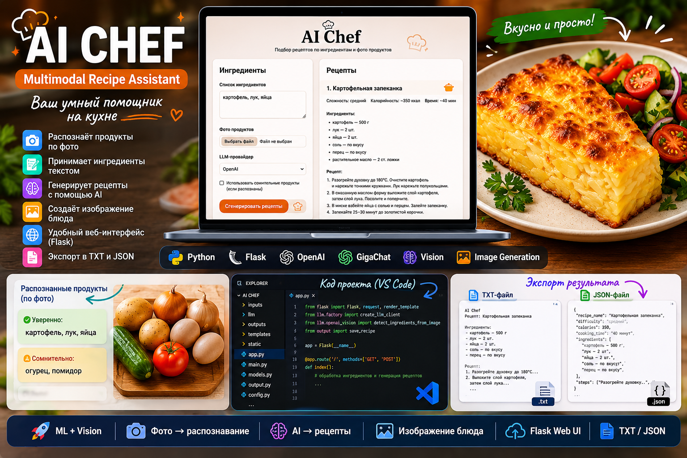
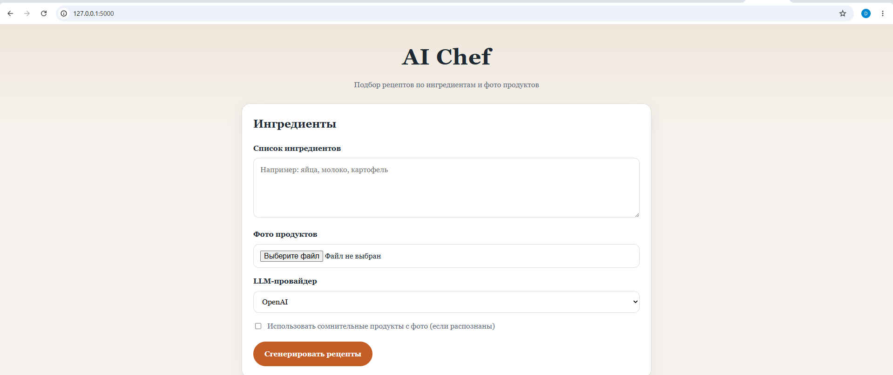
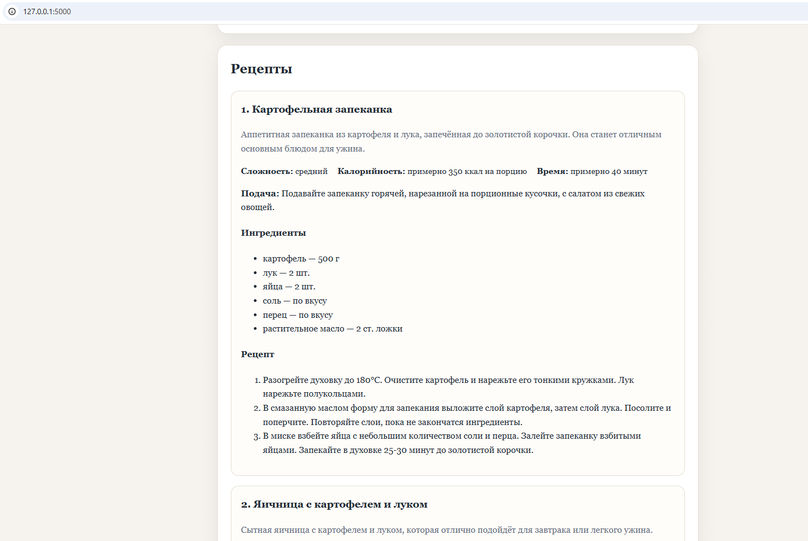
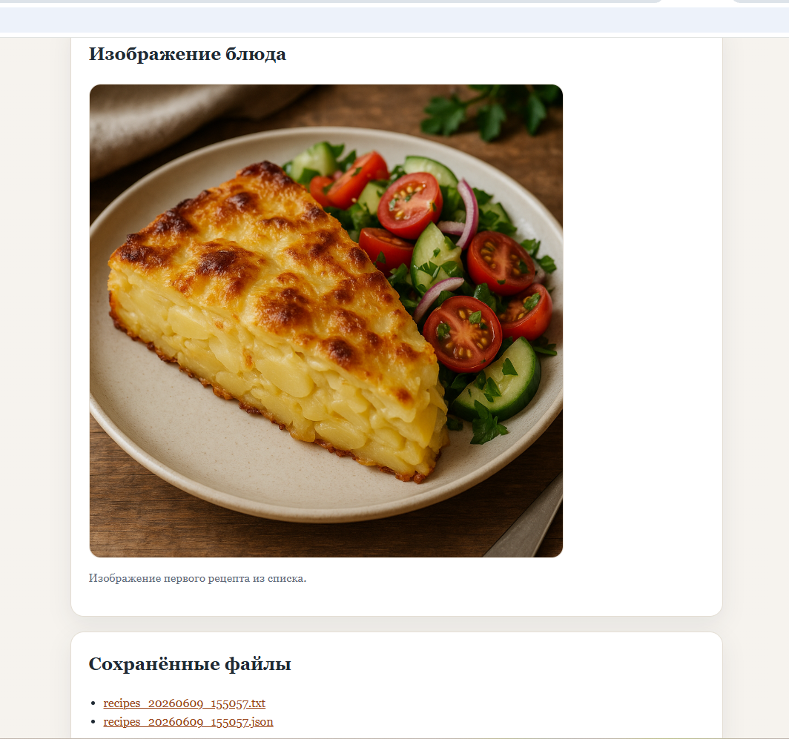
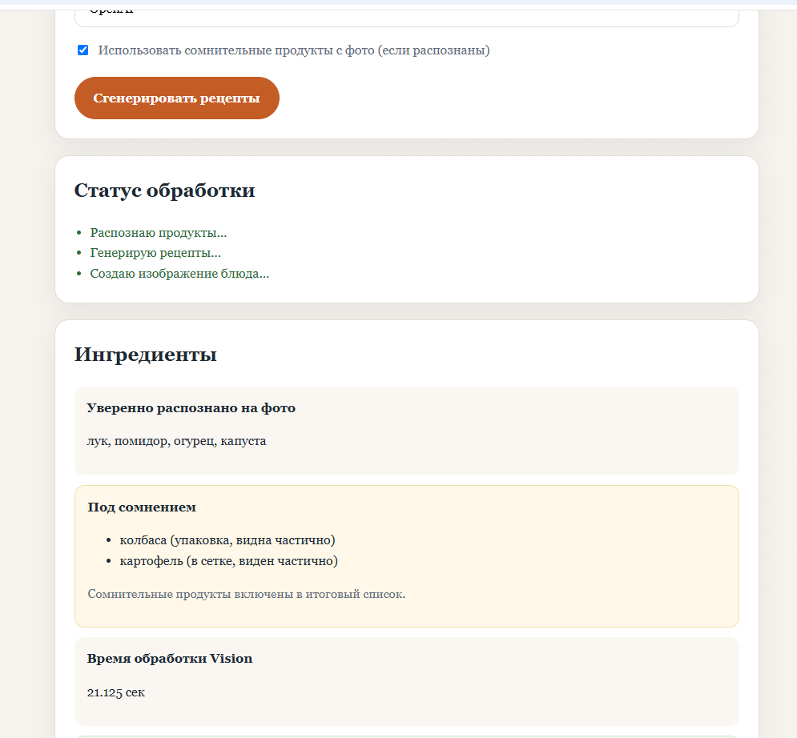
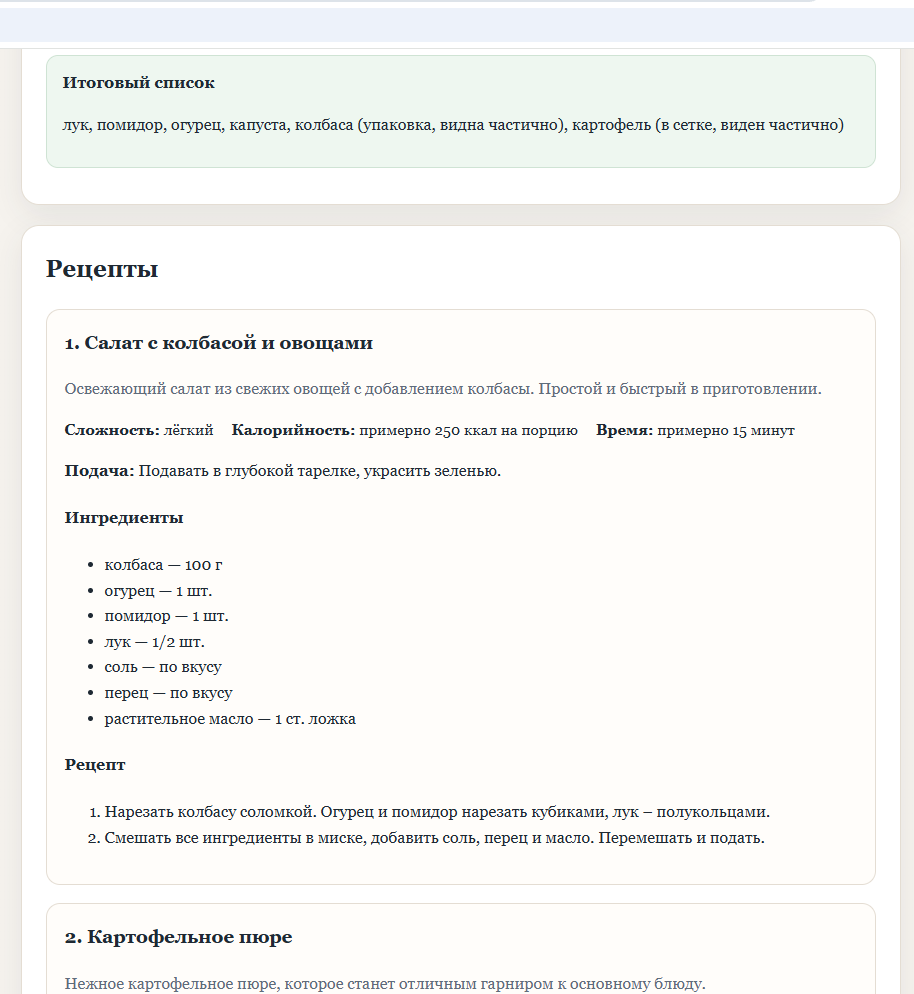
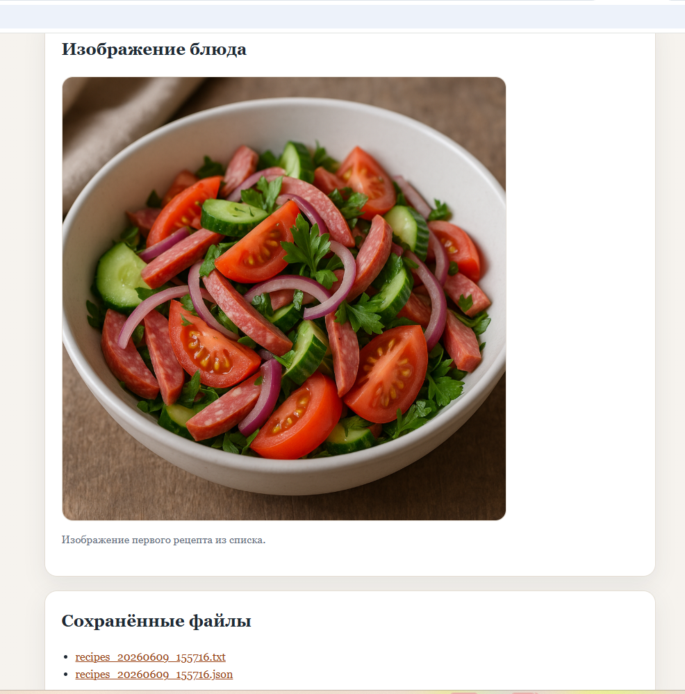

# 👨‍🍳 AI Chef — Multimodal Recipe Assistant



**AI Chef** — мультимодальный AI-ассистент, который помогает подобрать рецепты из продуктов, уже имеющихся у пользователя.

Ингредиенты можно указать текстом или загрузить фотографию продуктов. Система распознаёт продукты с помощью компьютерного зрения, формирует рецепты через LLM и создаёт изображение готового блюда.

Проект демонстрирует полный прикладной AI-пайплайн: **изображение / текст → распознавание → обработка данных → LLM → структурированный результат → генерация изображения**.

---

## 🚀 Возможности

- 📝 ввод ингредиентов текстом;
- 📷 загрузка фотографии продуктов;
- 👁️ распознавание ингредиентов с помощью OpenAI Vision;
- ⚠️ разделение распознанных продуктов на уверенные и сомнительные;
- ☑️ возможность включить сомнительные продукты в итоговый список;
- 🧠 генерация трёх рецептов через OpenAI или GigaChat;
- 🍽️ описание ингредиентов и пошагового приготовления;
- ⏱️ оценка времени приготовления, сложности и калорийности;
- 🎨 генерация изображения первого предложенного блюда;
- 🌐 веб-интерфейс на Flask;
- 💻 CLI-режим;
- 📄 сохранение результатов в TXT и JSON;
- 🛡️ обработка ошибок внешних API без падения приложения.

---

# 🖥️ Демонстрация работы

## 📝 Сценарий 1 — ингредиенты текстом

Пользователь может просто перечислить продукты, которые есть дома.



AI Chef передаёт список продуктов языковой модели и формирует три варианта блюд с описанием, ингредиентами и инструкцией приготовления.



Для первого предложенного рецепта система дополнительно генерирует изображение готового блюда.



---

## 📷 Сценарий 2 — распознавание продуктов по фотографии

Вместо ручного ввода пользователь может загрузить фотографию продуктов.

Система анализирует изображение и разделяет найденные продукты на две группы:

- **уверенно распознанные**;
- **сомнительные** — пользователь сам решает, учитывать их или нет.



После обработки изображения формируется итоговый список ингредиентов и генерируются рецепты.



Для первого рецепта AI Chef создаёт изображение готового блюда.



---

## ⚙️ Как работает система

```text
Текст / фотография продуктов
            ↓
      OpenAI Vision
            ↓
   Распознавание продуктов
            ↓
Уверенные + сомнительные
            ↓
   Итоговый список продуктов
            ↓
     OpenAI / GigaChat
            ↓
        3 рецепта
            ↓
  Структурированный результат
            ↓
     OpenAI Image API
            ↓
  Изображение первого блюда
            ↓
      Flask Web UI
       + TXT / JSON
```

> При текстовом вводе этап распознавания изображения пропускается, и список ингредиентов сразу передаётся на генерацию рецептов.

---

## 🛠️ Стек технологий

- **Python** — основная логика приложения
- **Flask** — веб-интерфейс
- **OpenAI API** — работа с AI-моделями
- **OpenAI Vision** — распознавание продуктов по фотографии
- **OpenAI Image API** — генерация изображения блюда
- **GigaChat API** — альтернативный LLM-провайдер
- **python-dotenv** — работа с переменными окружения
- **HTML / CSS** — пользовательский интерфейс
- **Git / GitHub** — контроль версий и публикация проекта

---

## 📁 Структура проекта

```text
AI Chef/
├── app.py                  # Flask-приложение
├── main.py                 # CLI-запуск
├── config.py               # конфигурация
├── models.py               # модели данных
├── output.py               # сохранение TXT/JSON
├── prompts.py              # промпты для LLM
│
├── llm/
│   ├── openai_client.py    # генерация рецептов через OpenAI
│   ├── openai_vision.py    # распознавание продуктов
│   ├── openai_image.py     # генерация изображения блюда
│   ├── gigachat_client.py  # генерация через GigaChat
│   └── factory.py          # выбор LLM-провайдера
│
├── templates/
│   └── index.html
│
├── static/
│   └── style.css
│
├── assets/                 # изображения для README
├── requirements.txt
├── .env.example
└── README.md
```

---

## ▶️ Запуск

### 1. Клонировать репозиторий

```bash
git clone https://github.com/andrgol12-sys/ai-chef-multimodal-assistant.git
cd ai-chef-multimodal-assistant
```

### 2. Создать виртуальное окружение

```bash
python -m venv .venv
```

Windows PowerShell:

```powershell
.venv\Scripts\activate
```

### 3. Установить зависимости

```bash
pip install -r requirements.txt
```

### 4. Настроить `.env`

Создайте `.env` на основе `.env.example` и добавьте необходимые API-ключи.

Пример:

```env
LLM_PROVIDER=openai

OPENAI_API_KEY=your_openai_api_key
OPENAI_MODEL=gpt-4o-mini
OPENAI_VISION_MODEL=gpt-4o-mini

GIGACHAT_CREDENTIALS=your_gigachat_authorization_key
GIGACHAT_VERIFY_SSL=false

FLASK_SECRET_KEY=your_secret_key
```

### 5. Запустить веб-интерфейс

```bash
python app.py
```

После запуска открыть в браузере:

```text
http://127.0.0.1:5000
```

---

## 💻 CLI-режим

Интерактивный запуск:

```bash
python main.py
```

По текстовым ингредиентам:

```bash
python main.py --ingredients картофель лук яйца
```

По фотографии:

```bash
python main.py --image fridge.jpg
```

Фото + дополнительные ингредиенты:

```bash
python main.py --image fridge.jpg --ingredients соль перец масло
```

---

## 🧪 Что протестировано

- генерация рецептов по текстовому списку ингредиентов;
- распознавание продуктов по фотографии;
- обработка сомнительно распознанных продуктов;
- формирование итогового списка ингредиентов;
- генерация трёх вариантов блюд;
- генерация изображения первого блюда;
- сохранение результатов в TXT и JSON;
- CLI-режим;
- Flask-интерфейс;
- обработка ошибок внешних API.

---

## ⚠️ Ограничения MVP

Точность распознавания зависит от качества фотографии и видимости продуктов. Продукты в упаковке, сетке или частично скрытые предметы Vision-модель может определить неточно.

Для этого предусмотрен отдельный механизм работы с сомнительными ингредиентами: система показывает их пользователю отдельно и позволяет самостоятельно решить, учитывать их при генерации рецептов или нет.

---

## 💼 Где можно применить

Подобное решение может использоваться как основа для:

- AI-помощника по подбору рецептов;
- сервиса «что приготовить из того, что есть дома»;
- приложения для анализа содержимого холодильника;
- помощника для планирования меню;
- food-tech сервисов;
- Telegram- или мобильного приложения с распознаванием продуктов;
- корпоративных решений для ресторанов и служб питания.

---

## 🚀 Возможности развития

Проект можно расширить:

- учётом пищевых предпочтений и ограничений;
- расчётом КБЖУ;
- подбором рецептов под заданную калорийность;
- сохранением любимых рецептов;
- историей приготовленных блюд;
- формированием списка покупок;
- распознаванием большего количества продуктов на сложных фотографиях;
- Telegram-ботом или мобильным интерфейсом.

---

## 👨‍💻 О проекте

**AI Chef** — прикладной мультимодальный AI-проект, объединяющий работу с текстом, изображениями и генеративными моделями в одном пользовательском сценарии.

Главная задача проекта — показать, как несколько AI-компонентов можно объединить в законченное приложение: от получения исходных данных до готового результата для пользователя.

**Статус:** MVP готов.
